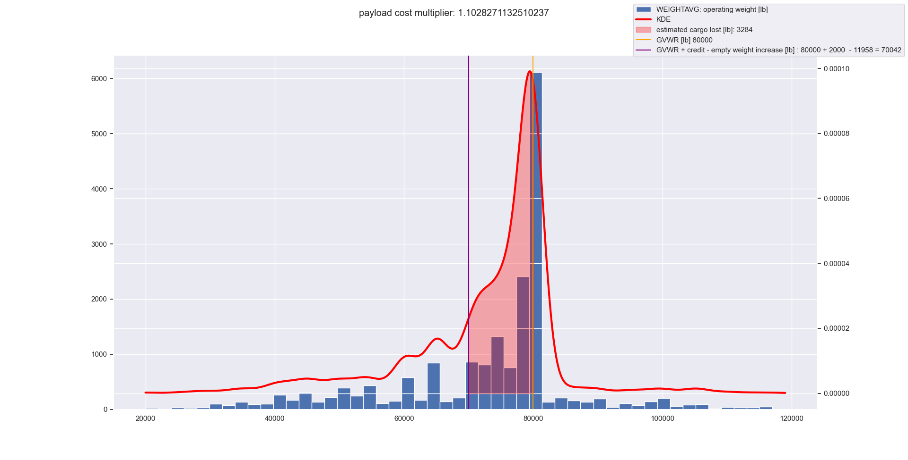

# Contents
- [Contents](#contents)
  - [Overview ](#overview)
  - [Vehicle MSRP ](#vehicle-msrp)
        - [MSRP Inputs](#msrp-inputs)
        - [MSRP Formula](#msrp-formula)
        - [MSRP Code](#msrp-code)
  - [Fuel Costs ](#fuel-costs)
  - [Other Costs ](#other-costs)
  - [Payload Opportunity Costs ](#payload-opportunity-costs)
  - [Stock Model TCO Calculations ](#stock-model-tco-calculations)
  - [BEV considerations ](#bev-considerations)
  - [PHEV considerations ](#phev-considerations)
  - [Fuel Costs Table ](#fuel-costs-table)

## Overview <a name="overview"></a>
The Total Cost of Ownership is a core metric calculated by T3CO. It is made up of a few parts. The first is **MSRP**, or the purchase cost of the vehicle. Then there is fuel cost for each operational year. Then there are "other costs" as well as Payload Opportunity Costs.

## Vehicle MSRP <a name="vehicle-msrp"></a>
The vehicle MSRP is composed of a glider cost, powertrain costs from engine and/or motor, energy storage for liquid fuel or battery pack, the plug for PHEVs and EVs, the battery replacement cost (rarely used), & the Purchase tax. 

**example**

    'veh_msrp_set': {   
      'Battery': 7309.147060965,
      'Battery replacement': 0,
      'Fuel Storage': 382.918608555,
      'Fuel converter': 18554.678768654998,
      'Glider': 121918.9997,
      'Motor & power electronics': 627.78252096,
      'Plug': 0.0,
      'Purchase tax': 0.0,
      'msrp': 148793.526659135
    }

The Glider and Plug costs are straight inputs from the T3CO scenario file. Battery and Fuel Storage are computed on a `$/kWh` basis. Fuel converter and Motor & power electronics are computed on a `$/kW` also from the T3CO [scenario file](ScenarioFile.md).

##### MSRP Inputs <a name="msrp-inputs"></a>
|column name|example value| bounds |
|---|----|----|
|`ess_cost_dol_per_kw`|`0`| `float` |
|`ess_cost_dol_per_kwh`|`85`| `float`|
|`ess_base_cost_dol`|`0`| `float`|
|`ess_cost_reduction_dol_per_yr`|`0`| `float`|
|`ess_salvage_value_dol`|`0`| `float`|
|`pe_mc_cost_dol_per_kw`|`11`| `float`|
|`pe_mc_base_cost_dol`|`350`| `float`|
|`fc_ice_cost_dol_per_kw`|`50`| `float`|
|`fc_ice_base_cost_dol`|`6250`| `float`|
|`fc_fuelcell_cost_dol_per_kw`|`85`| `float`|
|`fs_cost_dol_per_kwh`|`0.07`| `float`|
|`fs_h2_cost_dol_per_kwh`|`9.5`| `float`|
|`plug_base_cost_dol`|`500`| `float`|
|`markup_pct`|`1.2`| `float`|
|`tax_rate_pct`|`0.035`| `float`|
|`fc_cng_ice_cost_dol_per_kw`|`55`|`float` |
|`fs_cng_cost_dol_per_kwh`|`7.467735503`|`float` |
|`vehicle_glider_cost_dol`|`112759`| `float`|
##### MSRP Formula <a name="msrp-formula"></a>

    vehicle_glider_cost_dol = scenario.vehicle_glider_cost_dol
    
    # fcPrice
    if veh.veh_pt_type == gl.BEV or veh.fc_max_kw == 0:
        fcPrice = 0

    elif veh.fc_eff_type == 'H2FC':
        fcPrice = scenario.fc_fuelcell_cost_dol_per_kw * fc_max_kw

    elif veh.fc_eff_type == 9:
        fcPrice = ((scenario.fc_cng_ice_cost_dol_per_kw * fc_max_kw) + fc_ice_base_cost_dol)

    else:
        fcPrice = ((fc_ice_cost_dol_per_kw * fc_max_kw) + fc_ice_base_cost_dol)
    fcPrice *= markup_pct
    
    # fuelStorPrice
    if veh.veh_pt_type == gl.BEV:
        fuelStorPrice = 0
    elif veh.veh_pt_type == gl.HEV and scenario.fuel_type == 'hydrogen':
        fuelStorPrice = scenario.fs_h2_cost_dol_per_kwh * veh.fs_kwh
    elif veh.veh_pt_type in [gl.CONV, gl.HEV, gl.PHEV] and scenario.fuel_type == 'cng':
        fuelStorPrice = scenario.fs_cng_cost_dol_per_kwh * veh.fs_kwh
    elif veh.veh_pt_type in [gl.CONV, gl.HEV, gl.PHEV]:
        fuelStorPrice = scenario.fs_cost_dol_per_kwh * veh.fs_kwh
    fuelStorPrice *= markup_pct

    # calculate mcPrice
    mc_max_kw = veh.mc_max_kw
    if mc_max_kw == 0:
        mcPrice = 0
    else:
        mcPrice = (pe_mc_base_cost_dol + (pe_mc_cost_dol_per_kw * mc_max_kw))
    mc_max_kw *= markup_pct

    # calc ESS price
    if veh.ess_max_kwh == 0:
        essPrice = 0
    else:
        essPrice = (ess_base_cost_dol + (ess_cost_dol_per_kwh * veh.ess_max_kwh))
    essPrice *= markup_pct

    # calc plugPrice
    if veh_pt_type == gl.PHEV or veh_pt_type == gl.BEV or (veh_pt_type == gl.HEV and chargingOn):
        plugPrice = plugPrice
    else:
        plugPrice = 0
    plugPrice *= markup_pct

    if veh_pt_type == gl.CONV:
        msrp = vehicle_glider_cost_dol + fuelStorPrice + fcPrice
    # could be HEV or FCEV
    elif veh_pt_type == gl.HEV:
        msrp = vehicle_glider_cost_dol + fuelStorPrice + fcPrice + mcPrice + essPrice
    elif veh_pt_type == gl.PHEV:
        msrp = vehicle_glider_cost_dol + fuelStorPrice + fcPrice + mcPrice + essPrice + plugPrice
    elif veh_pt_type == gl.BEV:
        msrp = vehicle_glider_cost_dol + mcPrice + essPrice + plugPrice

    pTaxCost = tax_rate_pct * msrp

    cost_set = {
        "Glider": vehicle_glider_cost_dol,
        "Fuel converter": fcPrice,
        "Fuel Storage": fuelStorPrice,
        "Motor & power electronics": mcPrice,
        "Plug": plugPrice,
        "Battery": essPrice,
        "Battery replacement": 0,
        "Purchase tax": pTaxCost,
        "msrp": msrp
    }
##### MSRP Code
Code to [generate MSRP](https://github.com/NREL/T3CO/blob/ecad5e28523ac3e5a17c67b9ed747207f6162035/t3co/tco/tcocalc.py#L24)


## Fuel Costs <a name="fuel-costs"></a>

Fuel costs make up a plurality, if not the majority, of TCO. As one would expect, fuel costs per year are dependant on three things: The fuel efficiency of the vehicle, the miles travelled per year, and the cost per unit of fuel. All [fuel efficiencies](./fuel_efficiency_and_range.md) are converted to miles per gallon of gasoline equivalent (MPGGE). All fuel costs are converted to dollars per gallon of gasoline equivalent. 
```
sum up all years
  fuel_cost_year_i = miles_travelled_year_i / mpgge * $/gge
```
Fuel efficiency is populated ([code](https://github.com/NREL/T3CO/blob/ecad5e28523ac3e5a17c67b9ed747207f6162035/t3co/tco/tcocalc.py#L168)) [as per these docs.](./fuel_efficiency_and_range.md) 


|Model Year|Region|Vehicle|Vocation|Fuel|Fuel Efficiency [mi/gge]|Age [yr]|
|----|----|----|----|----|----|----|
|2022|United States|MD BOX TRUCK|BOX TRUCK|Diesel|4.6|

This table is eventually joined in the Stock Model Code with other tables. For example, if the vehicle has a 5 year life span:

|Year|Fuel|Category|Cost [$/gge]
|----|----|----|----|
|2022|Diesel|Fuel| 3.98 |
|2023|Diesel|Fuel| 4.10 |
|2024|Diesel|Fuel| 4.20 |
|2025|Diesel|Fuel| 4.29 |
|2026|Diesel|Fuel| 4.35 |

Then there is the annual travel table ([code](https://github.com/NREL/T3CO/blob/ecad5e28523ac3e5a17c67b9ed747207f6162035/t3co/tco/tcocalc.py#L367)), made up from `vmt` in the Scenario file 

|Age [yr]|Annual Travel [mi/yr]|
|----|----|
|0|100,000|
|1|100,000|
|2|90,000|
|3|85,000|
|4|80,000|

Finally, these are all joined with the fuel split table ([code](https://github.com/NREL/T3CO/blob/ecad5e28523ac3e5a17c67b9ed747207f6162035/t3co/tco/tcocalc.py#L425)), such that each fuel used is assessed pro rata based on the proportion of usage for driven miles. This comes into play for PHEVs and their [Utility Factor](PHEVs.md#phev-fuel-costs)

Usual **Conventional or HEV format**:
|Vehicle|Fuel|Vocation|Fraction of Travel [mi/mi]|
|----|----|----|----|
|MD BOX TRUCK|Diesel|BOX TRUCK| 1 |
Or **BEV Format**: 
|Vehicle|Fuel|Vocation|Fraction of Travel [mi/mi]|
|----|----|----|----|
|MD EV BOX TRUCK|Electricity|BOX TRUCK| 1 |

**PHEV format**, where utility factor is .6 (60% of the time vehicle is in charge depleting mode):
|Vehicle|Fuel|Vocation|Fraction of Travel [mi/mi]|
|----|----|----|----|
|MD PHEV BOX TRUCK|cd_diesel|BOX TRUCK| .6 |
|MD PHEV BOX TRUCK|cd_electricity|BOX TRUCK| .6 |
|MD PHEV BOX TRUCK|cs_diesel|BOX TRUCK| .4 |

These joins happen in the [Stock Model Code](https://github.com/NREL/T3CO/blob/master/t3co/tco/tco_stock_emissions.py).


## Other Costs <a name="other-costs"></a>

There are other costs for vehicles during their TCO operational period ([code](https://github.com/NREL/T3CO/blob/ecad5e28523ac3e5a17c67b9ed747207f6162035/t3co/tco/tcocalc.py#L263)). These costs are, but not limited to, maintenance costs  `$/mile`, for both conventional and advanced powertrains, denoted from the Scenario input file as `maint_oper_cost_dol_per_mi` provided as a list across the vehicle life

There is also `payload opportunity cost` (under development), as well as optional `time opportunity costs` and `labor opportunity costs`. Also under development.

**other costs table**

|Region|Vocation|Vehicle|Category|Cost [$/mi]|
|----|----|----|----|----|
|United States|BOX TRUCK|MD BOX TRUCK|maintenance| .32 | 
|United States|BOX TRUCK|MD BOX TRUCK|payload opp cost| 0 | 
|United States|BOX TRUCK|MD BOX TRUCK|time opp cost"| 0 | 
|United States|BOX TRUCK|MD BOX TRUCK|labor opp cost| 0 | 


## Payload Opportunity Costs <a name="payload-opportunity-costs"></a>

**Payload Opportunity Cost** is the concept of applying an opportunity cost to payload capacity that might be lost due to increasing a vehicle vocation empty weight when electrifying the powertrain. In the example below, the empty weight of the vehicle increased by 11,958 pounds. This region, less the EV weight credit of 2,000 pounds, is shaded in red under the kernel density estimate, representing potential lost cargo due to electrification and added battery weight.



## Stock Model TCO Calculations <a name="stock-model-tco-calculations"></a>

Total vehicle costs are compiled via a series elegant of table `INNER JOINS` in the stock model [code](https://github.com/NREL/T3CO/blob/master/t3co/tco/tco_stock_emissions.py). 

## BEV considerations <a name="bev-considerations"></a>

Vehicles that run on alternative fuels such as BEVs, FCEVs (treated as HEV by FASTSim), run on fuels, such as hydrogen or electricity, that need to be converted to a gallon of gasoline equivalent unit for fuel efficiency, `MPGGE`, and cost, `$/GGE`. The code where these conversions happen is [here](https://github.com/NREL/T3CO/blob/ecad5e28523ac3e5a17c67b9ed747207f6162035/t3co/tco/tcocalc.py#L339):


## PHEV considerations <a name="phev-considerations"></a>

PHEVs have the same considerations as BEVs, but with the added twist of Utility Factors, which can come in as a user input in the Scenario File, or get computed. See [PHEV Considerations](PHEVs.md#phev-fuel-costs-and-utility-factor).

## Fuel Costs Table <a name="fuel-costs-table"></a>
The default fuel costs table is located at [`t3co/resources/auxiliary/FuelPrices.csv`](https://github.com/NREL/T3CO/blob/cda7afc644602f406f659e2c11ffad9b1da379bd/t3co/resources/auxiliary/FuelPrices.csv)

