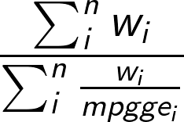

# Contents
- [Fuel Efficiency Calculations](#fueleffcalcs)
- [Range From Fuel Efficiency](#rangefromfueleff)
- [A Note on PHEVs](#PHEVs)

## Fuel Efficiency Calculations <a name="fueleffcalcs"></a>

Fuel efficiency calculations in **T3CO** yield a variety of metrics based on the energy output from the vehicle's fuel stores and battery, taken from **FASTSim.SimDrive** object results. For the purposes of finding vehicle range [miles] and fuel efficiency, If the user inputs a composit drive cycle, then the fuel efficiency is a blend computed from each drive cycle's mpgge (miles per gallon of gasoline equivalent, for example) and that drive cycle's weight, using a weighted harmonic average.





Composite drive cycle input example: `[("EPA_Ph2_rural_interstate_65mph.csv", .86), ("EPA_Ph2_urban_highway_55mph.csv", .09), ("EPA_Ph2_transient.csv", .05)]`

Input file example:

| selection | scenario_name | drive_cycle |
|-----------|---------------| -----------|
| 1 | Class 8 Sleeper cab high roof (Diesel, 2020, no program) | [("EPA_Ph2_rural_interstate_65mph.csv", .86), ("EPA_Ph2_urban_highway_55mph.csv", .09), ("EPA_Ph2_transient.csv", .05)] |
| 2 | Class 8 Sleeper cab mid roof (Diesel, 2020, no program) | [("EPA_Ph2_rural_interstate_65mph.csv", .86), ("EPA_Ph2_urban_highway_55mph.csv", .09), ("EPA_Ph2_transient.csv", .05)] |
| 3 |	Class 8 Sleeper cab low roof (Diesel, 2020, no program) |	[("EPA_Ph2_rural_interstate_65mph.csv", .86), ("EPA_Ph2_urban_highway_55mph.csv", .09), ("EPA_Ph2_transient.csv", .05)] |

**fuel efficiency** metrics are computed in `t3co.objectives.fuel_economy.py`

For Conventionals, BEVs, HEVs/FCEVs, we calculate their fuel economies as
|Code Variable| Definition |
|--|--|
|mpgge | miles per gallon of gasoline equivalent |
|grid_mpgge | grid adjusted (charger efficiency) miles per gallon of gasoline equivalent |
|mpgde | miles per gallon of diesel equivalent |
|kwh_per_mi | kWh per mile |

For plug-in hybrids (PHEVs) we calculate 

|Code Variable| Definition|
|--|--|
|cs_fuel_mpgge| Charge Sustaining miles per gallon of gasoline equivalent from ICE fuel stores only|
|cs_fuel_mpgde| Charge Sustaining miles per gallon of **diesel** equivalent from ICE fuel stores only|
|cs_fuel_kwh__mi| Charge Sustaining kWh per mile from ICE fuel stores only |
|cd_fuel_mpgge| Charge Depleting miles per gallon of gasoline equivalent from ICE fuel stores only|
|cd_fuel_mpgde| Charge Depleting miles per gallon of **diesel** equivalent from ICE fuel stores only|
|cd_electric_mpgge| Charge Depleting miles per gallon of gasoline equivalent from PHEV battery pack only |
|cd_grid_electric_mpgge| Charge Depleting grid adjusted (charger efficiency) miles per gallon of gasoline equivalent from PHEV battery pack only|
|cd_electric_kwh__mi| Charge Depleting kWh per mile from PHEV battery pack only |
|cd_fuel_kwh__mi| Charge Depleting kWh per mile from ICE fuel stores only|
|ave_combined_kwh__mile| Average combined kWh per mile `AveCombinedkWhperMile = UF*(CDelectricityKWhperMile + CDfuelKWhpermile) + (1-UF)*CSfuelKWhperMile`|

*Note, UF stands for Utility Factor*

For each drive cycle in the **T3CO** scenario file, a weighted value for these fuel economy metrics is calculated. 

## Range From Fuel Efficiency <a name="rangefromfueleff"></a>

The process for determining range depends on determining the fuel economy of the vehicle based on design cycles or a set of design cycles with weights. Design cycle or composite design cycles are specifed in the `Scenario` input file under the `drive_cycle` column. Fuel economy is determined in the `t3co\objectives\fueleconomy.py` module. The logic for fuel economy is essentially
```
for cycle_i, weight_i in (cycles, cycle_weights)
    if PHEV
        get charge depleting mpgge with infinite battery and init_soc = max_soc
        get charge sustaining mpgge with "normal" battery and init_soc = min_soc + 0.01 
    else
        init_soc comes from simdrive()
        BEVs use max_soc
        HEVs use balanced SOC
        Conv init_soc doesn't matter
        if vehicle is Conv or HEV
            mpgge = sim_drive.mpgge
        else it's a BEV
            mpgge = sim_drive.mpgge + (1/sim_drive.electric_kwh_per_mi) * gl.get_kwh_per_gge()
            
    # get weighted mpgge vales
    'mpgge': sum([w_i for w_i in weights]) / sum([w_i / mpgge_i['mpgge'] for w_i, mpgge_i in zip(weights, mpgges)])
```

Range from fuel economy is a calculation based on the vehicle's MPGGE (miles per gallon of gasoline equivalent) and the GGE energy storage capacity the vehicle has. This is computed in `t3co.objectives.fuel_economy.get_range_mi`. 


    if vehicle is a BEV:
        range_mi = vehicle.ess_max_kwh * (vehicle.max_soc - vehicle.min_soc) * electric_mpgge / kwh_per_gge
    elif vehicle is a Conventional ICE:
        range_mi = (vehicle.fs_kwh / kwh_per_gge) * mpgge
    elif vehicle is an HEV:
        elec_range_mi = vehicle.ess_max_kwh * (vehicle.max_soc - vehicle.min_soc) * mpgge / kwh_per_gge
        conv_range_mi = (vehicle.fs_kwh / kwh_per_gge) * mpgge
        range_mi = elec_range_mi + conv_range_mi
    elif vehicle is a PHEV:
        # charge depleting range [miles]
        # CDrangeMiles = MIN( ESSmaxKWh*(CDmaxSOC- CDminSOC)/ CDelectricityKWhperMile , maxFuelStorKWh/33.7/ CDfuelGGEperMile )
        cd_range_mi = min(
            vehicle.ess_max_kwh * (vehicle.max_soc - vehicle.min_soc) / mpgge_info['cd_electric_kwh__mi'],
            vehicle.fs_kwh / kwh_per_gge * mpgge_info['cd_fuel_mpgge']
        )
        # charge sustaining range [miles]
        # note, CS range in this way of thinking, is essentially what range is *left over* after you've exhausted the battery to min SOC 
        # and switch into CS mode from CD mode, thus we subtract cd_gge_used from the GGE fuel stores of the vehicle
        cd_gge_used = cd_range_mi / mpgge_info['cd_fuel_mpgge']
        gge_capacity = vehicle.fs_kwh / kwh_per_gge
        cs_range_mi = (gge_capacity - cd_gge_used) * mpgge_info['cs_fuel_mpgge']
        range_mi = cd_range_mi + cs_range_mi
    return range_mi        

## A Note on PHEVs <a name="PHEVs"></a>
##### **PHEV fuel economy**

The **CD** and **CS** in the PHEV fuel economy table stand for **charge sustaining** and **charge depleting**, these are two defined "modes" of operation described below. These are described in detail in the PHEV documentation.

**PHEVs** generate multiple metrics for fuel efficiency based on the two operating modes, CD and CS. As seen above, they are used for for computing the range of the vehicle. 
