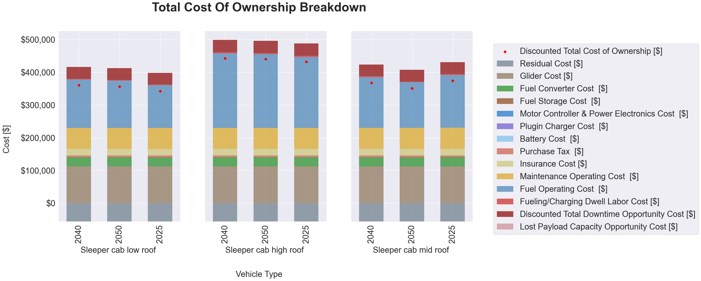
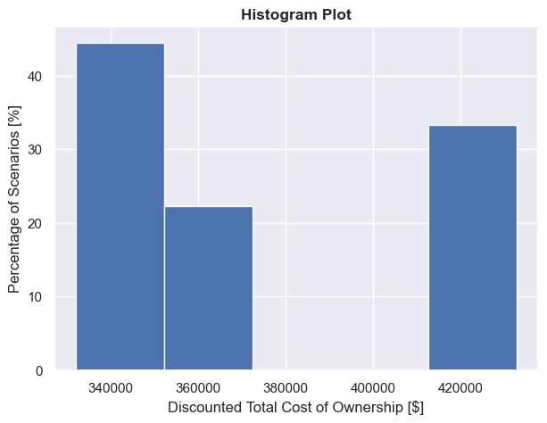
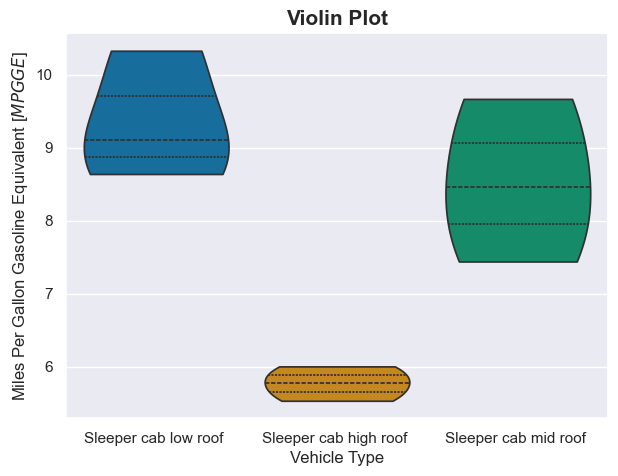

# Visualization

The [`T3COCharts`](./api/charts.md) class (`t3co.visualize.charts`) turns a T3CO results CSV (or DataFrame) into three plots, each rendered with a selectable backend:

- `backend="matplotlib"` (default) — static figures for PNG/PDF export.
- `backend="plotly"` — interactive, self-contained HTML.

## Install

The plotting libraries are an optional extra:

```bash
pip install t3co[viz]
```

`matplotlib` is already a core T3CO dependency, so the TCO breakdown and histogram render without the extra. The violin plot additionally needs `seaborn`, and the interactive HTML backend needs `plotly`.

## Usage

```python
from t3co.visualize.charts import T3COCharts

tc = T3COCharts(filename="results.csv", backend="plotly")
fig = tc.generate_tco_plots(x_group_col="vehicle_fuel_type", subplot_group_col="vehicle_type")
fig.write_html("tco_breakdown.html")   # or fig.savefig(...) with the matplotlib backend

# Combine several Plotly figures into one self-contained HTML report:
T3COCharts.write_html_report(
    [
        tc.generate_tco_plots(x_group_col="vehicle_fuel_type"),
        tc.generate_histogram(hist_col="discounted_tco_dol", n_bins=10),
        tc.generate_violin_plot(x_group_col="vehicle_fuel_type", y_group_col="mpgge"),
    ],
    "charts.html",
)
```

`T3COCharts` reads the prefixed result columns directly and derives the grouping columns (`vehicle_fuel_type`, `vehicle_type`, `vehicle_weight_class`, `veh_pt_type`) automatically. Each `generate_*` method returns a figure object that you save or display yourself.

### TCO Breakdown

Stacked cost components per scenario, with a marker for the discounted TCO. Pass `x_group_col` and/or `y_group_col` to split the results into a subplot grid (e.g. by fuel type and weight class).



### Histogram

Distribution of any numeric output across selections. `show_pct=True` plots the percentage of scenarios instead of a count.



### Violin

Distribution of a metric across categories (e.g. `mpgge` by fuel type).



## Interactive explorer

`interactive_explorer_html()` returns an HTML fragment: a Plotly scatter with two **`<select>` dropdowns to choose the x- and y-axis columns** — pick any grouping column or numeric output for either axis and the chart updates client-side, no server needed. It leads the combined HTML report.

```python
tc = T3COCharts(filename="results.csv", backend="plotly")
T3COCharts.write_html_report([tc.interactive_explorer_html()], "explorer.html")
```

## Grouped breakdown with a "Group by" dropdown

`grouped_tco_html()` returns an HTML fragment whose **"Group by" dropdown** facets the TCO breakdown into subplots by any category (fuel type, vehicle type, weight class, …), sharing one cost-component legend; "None" shows one bar per scenario. Switching is client-side, so it works in a static file. Pass `orient="y"` to facet into rows instead of columns.

```python
tc = T3COCharts(filename="results.csv", backend="plotly")
T3COCharts.write_html_report([tc.grouped_tco_html()], "breakdown.html")
```

## Charts from the CLI

Add `--plot` to any sweep run to generate the charts next to the results CSV. Install the extra first:

```bash
pip install t3co[viz]
```

Run an analysis by its `config.analysis_id` — from a **cloned repo** (uses the bundled `T3COConfig.csv`):

```bash
python -m t3co.cli.sweep --analysis-id=0 --plot
```

From a **PyPI install**, point `--config` at your copy of the demo inputs (see the [Quick Start](../quick_start.md)):

```bash
python -m t3co.cli.sweep --analysis-id=0 --config=path/to/demo_inputs/T3COConfig.csv --plot
```

Choose the backend, limit the selections, or set the output folder:

```bash
python -m t3co.cli.sweep --analysis-id=0 --plot matplotlib         # static PNGs instead of one HTML
python -m t3co.cli.sweep --analysis-id=0 --selections "[1,2,3]" --plot
python -m t3co.cli.sweep --analysis-id=0 --dst-dir=/abs/path/out --plot
```

### Where the output goes

Charts land next to the results CSV, in `config.dst_dir` (or `--dst-dir`):

```
results_<timestamp>_sel_<selections>.csv
results_<timestamp>_sel_<selections>_charts.html          # --plot: explorer + 3 charts in one file
results_<timestamp>_sel_<selections>_tco_breakdown.png    # --plot matplotlib: one PNG per chart
results_<timestamp>_sel_<selections>_tco_histogram.png
results_<timestamp>_sel_<selections>_tco_violin.png
```

!!! note
    A **relative** `dst_dir` / `--dst-dir` resolves against the config file's folder, not your current
    working directory. Pass an absolute path to control exactly where the output lands.

The [`visualization_demo.py`](https://github.com/NatLabRockies/T3CO/tree/main/src/t3co/demos/visualization_demo.py) script shows the full programmatic workflow in both backends.
